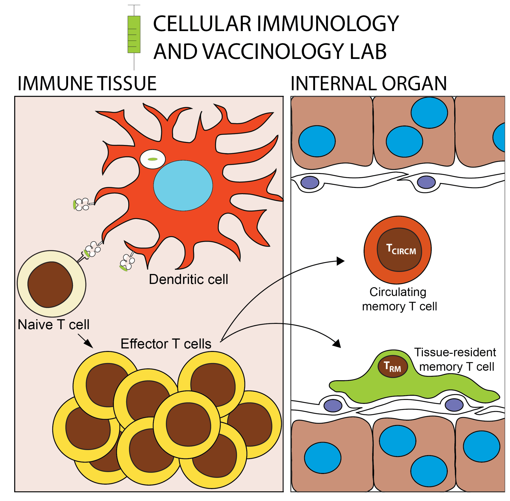

::: {.hero}
::: {.hero-copy}
UNSW Sydney · School of Biomedical Sciences · UNSW RNA Institute

## Programming T cell immunity for durable protection

The Cellular Immunology and Vaccinology Lab studies how T cells are activated, programmed and retained in tissues, and how these principles can be used to design better vaccines and immune interventions.

Our work connects fundamental T cell biology, RNA biology, vaccine development and malaria immunology, with a focus on tissue-resident memory T cells and translational pathways from mechanism to human disease.

[Explore our research](research.qmd){.btn .btn-primary .btn-lg}
[Join the lab](join-us.qmd){.btn .btn-outline-primary .btn-lg}
:::

::: {.hero-image-wrap}
{.hero-image fig-alt="Schematic showing activation of naive T cells by dendritic cells and the formation of circulating and tissue-resident memory T cells."}
:::
:::

::: {.section-intro}
## What we study

T cells can protect against infection and cancer, but they can also contribute to immune pathology. We ask how T cell fate is controlled, how protective immune memory is built in tissues, and how vaccines can be designed to generate the right cells in the right place at the right time.
:::

::: {.cards}
::: {.card}
### T cell programming and RNA biology

We investigate how cytokines, antigen recognition and non-coding RNA regulate T cell activation, differentiation and function.
:::

::: {.card}
### Vaccines and immune engineering

We apply mechanistic immunology to vaccine design, including mRNA and other experimental platforms aimed at durable T cell-mediated immunity.
:::

::: {.card}
### Malaria and tissue-resident immunity

We study liver-resident memory T cells and malaria immunity, using preclinical models and international partnerships to move discoveries toward human relevance.
:::
:::

## Recent focus

The lab is building a program at the interface of cellular immunology, RNA science and translational vaccinology. Current directions include non-coding RNA regulation of T cell fate, mRNA vaccine platforms for T cell-based protection, and malaria immunology in experimental and human systems.

## Where we work

The lab is based at the UNSW School of Biomedical Sciences and the UNSW RNA Institute in Sydney, Australia. We collaborate across immunology, genomics, RNA biology, chemistry, parasite biology, human samples and vaccine development.
